Egress Profisee REST API to ADLS Gen2 JSON Format
=================================================

This article describes a solution template that you can use to copy
member data from Profisee REST API to Azure Data Lake Storage Gen2 JSON
storage.

About this solution template
----------------------------

This template retrieves member data from Profisee REST API. It then
copies the member data, in JSON format, to a file in the Sink container.
The template will create a folder for the entity and copy the file to
that folder. The file name is composed of the entity name and date/time
in UTC with the .json extension.

**How to use this solution template**

1.  Go to the **Egress Profisee REST API to JSON** template.

> 

1.  Create a **New** or use an existing connection to the source
    Profisee REST API.

> 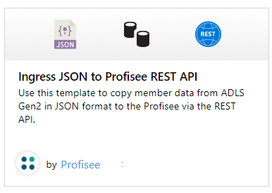

1.  Create a **New** or use an existing connection to the ADLS Gen2 sink
    data store that you are copying data to.

> 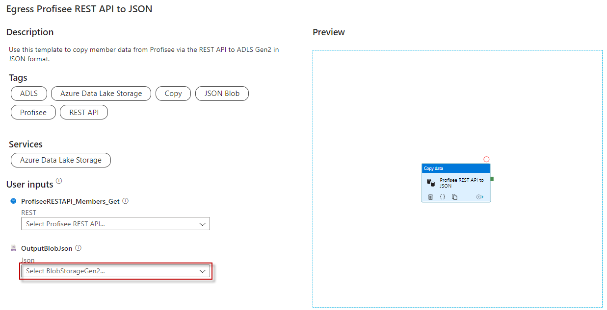

1.  Select **Use this template**.

> 

1.  You will see a pipeline created as shown in the following example:

> 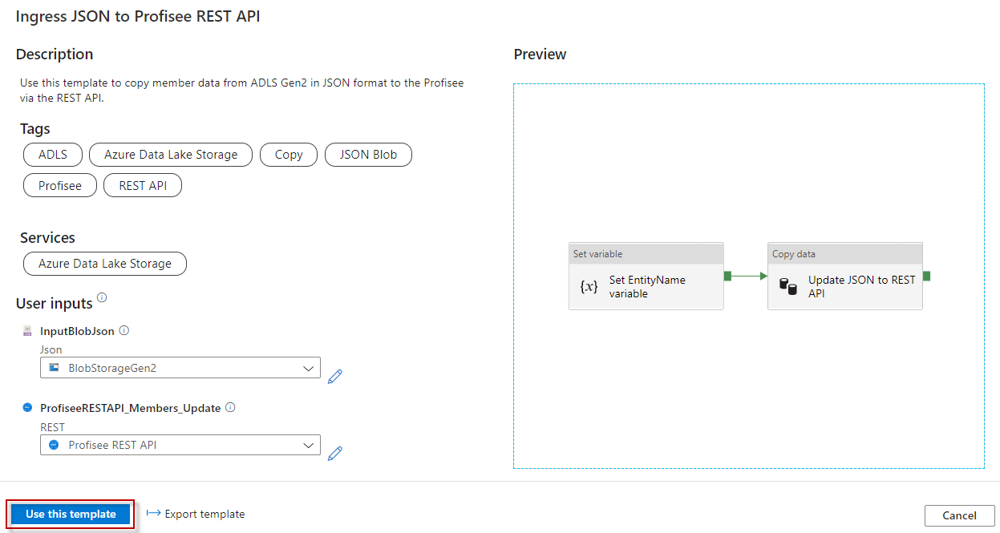
>
> You should also see the following template validation output.
>
> 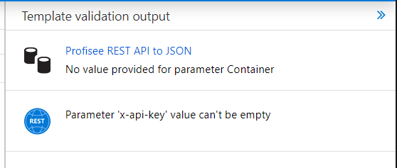
>
> There are three items needed for the pipeline, two of them are
> mentioned above.

1.  **EntityName:** The entity you are copying member data for. This is
    entered in the pipeline Variables tab.

> 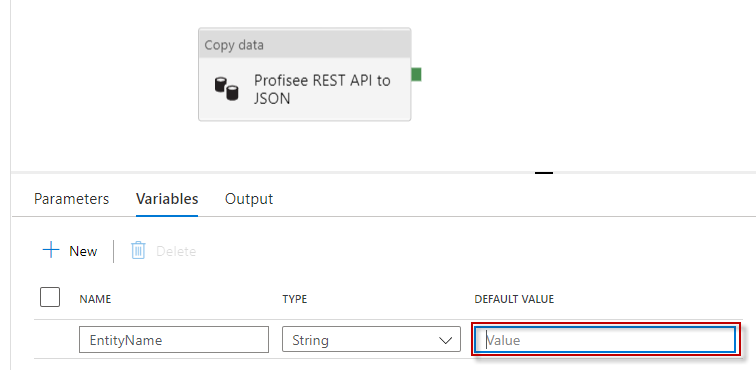

1.  **x-api-key:** The Profisee API key, which is the Client Id for the
    user account you are using to connect to the Profisee API. This is
    entered in the Source tab. **Note:** According to Microsoft, this
    will be an option in the Linked Service dialog when creating the
    REST API connection. We will update this documentation at that time.

> 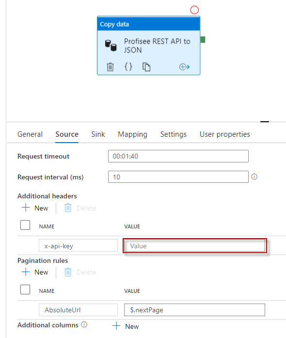

1.  **Container:** The output container name. This is entered in the
    Sink tab.

> 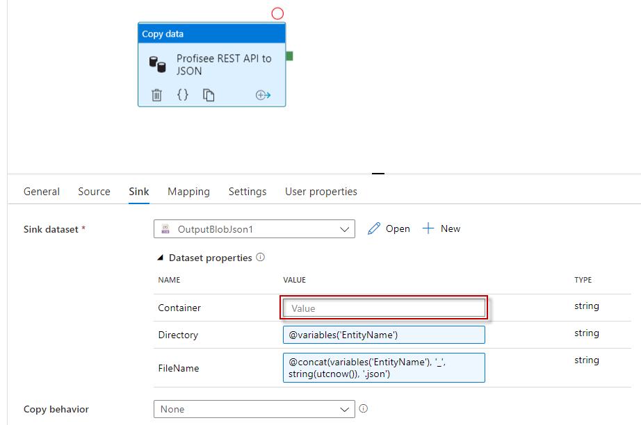

1.  Select **Mapping** tab to map the member data result properties to
    the corresponding JSON column.

> First click the **Import Schemas** button. You will be prompted to
> confirm the value of the pipeline parameter for the EntityName. Click
> **OK**.
>
> 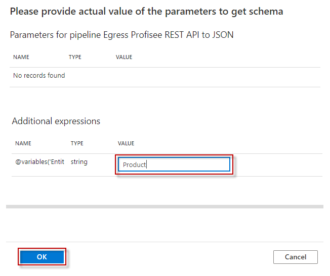
>
> After a couple of seconds, you will see a list of mapping fields
> listed, as shown in the following example.
>
> 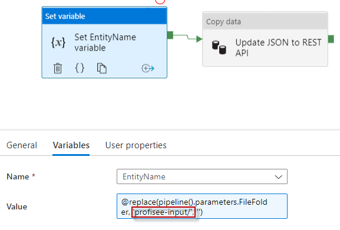
>
> Next, select **data** from the **Collection reference** drop down
> list. The **data** property is the array of member data.
>
> 
>
> Unselect the Include checkboxes for the pageNbr, pageSize,
> resultCount, totalPages, totalRecords, and nextPage properties as we
> are not going to be copying them to the file.
>
> 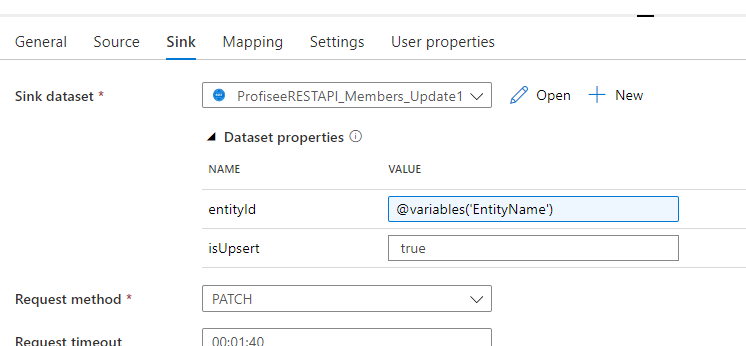
>
> After selecting the data collection reference, you need to correct the
> Column names for each property you want to copy. **Note:** Microsoft
> may change this to default to the correct Column names.
>
> From this
>
> 
>
> To this
>
> 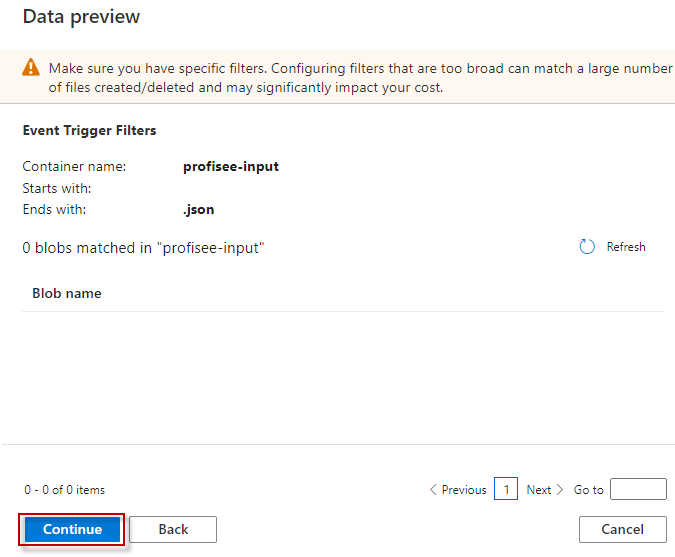

1.  Once you are finished with all your changes, click Publish All.

> 

1.  To run the pipeline now, select **Add Trigger** and select **Trigger
    now**. Press **OK** at the Pipeline run prompt.

2.  Select **Monitor** tab in the left navigation panel and wait for
    about 20 seconds. Click **Refresh** to get the updated run status.

3.  When the pipeline run completes successfully, you would see results
    like the following example:

> 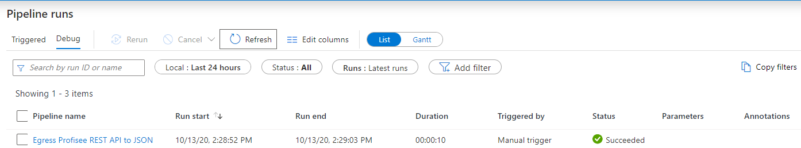

1.  You should also see the output file in the Container and Directory
    you entered.

> 

Source parameters
-----------------

> You can customize the member data get API query with the following
> parameters.

-   pageSize - The page size to get.  Defaults to 1000 if not supplied.

-   filter - A filter to restrict the members returned.

    -   &lt;attribute name&gt; &lt;operator&gt; &lt;value&gt;. E.g.
        Color = ‘BLU’. **NOTE**: This syntax will be changing slightly
        in the GA release.

    -   You can group attributes together using parenthesis and ANDs and
        ORs.

    -   You can also filter on AuditInfo columns.  Use the following
        property names:

        -   createdOn (datetime) - datetime the record was created, in
            UTC

        -   createdByUser (string) - user that created the record

        -   changedOn (datetime)) - datetime the record was last
            changed, in UTC

        -   changedByUser (string) - user that last changed the record

-   attributes - A comma separated list of entity attribute names to
    return.  Can include MLAs with dot notation. If blank, all
    attributes are returned. Note: the attribute list determines the
    result properties you will see in the **Mapping** tab.

    -   Multi-level attributes are supported, using the dot notation
        format to designate the MLA path

    -   Example: Color,Class,ProductSubCategory,SellStartDate,SellEndDate,Weight,ProductSubCategory.ProductCategory.ProductGroup

-   orderBy - A comma separated list of entity attribute names and
    direction to order the response

    -   &lt;attribute name&gt; or &lt;attribute name&gt; asc - sorts
        attribute in ascending order

    -   &lt;attribute name&gt; desc - sorts attribute in descending
        order

    -   Example: 

        -   ProductSubCategory, SellStartDate desc

-   dbaFormat - The domain-based attribute (DBA) format to return.
    Provides an option to indicate how to return the DBA's Code and
    Name.  Note: a DBA is an attribute that points to, or references,
    another entity, called a domain entity. 

    -   Code only (default) - Only return the code value.

        -   Example: 

            -   "Source System": "SF",

    -   Code and Name simple properties.  The name property is returned
        as DBA.Name.

        -   Example: 

            -   "Source System": "SF",

            -   "Source System.Name": "Salesforce",

    -   Code and Name complex property.

        -   Example:

            -   "Source System": {  
                      "Name": "Salesforce",

>        "Code": "SF"
>
> }

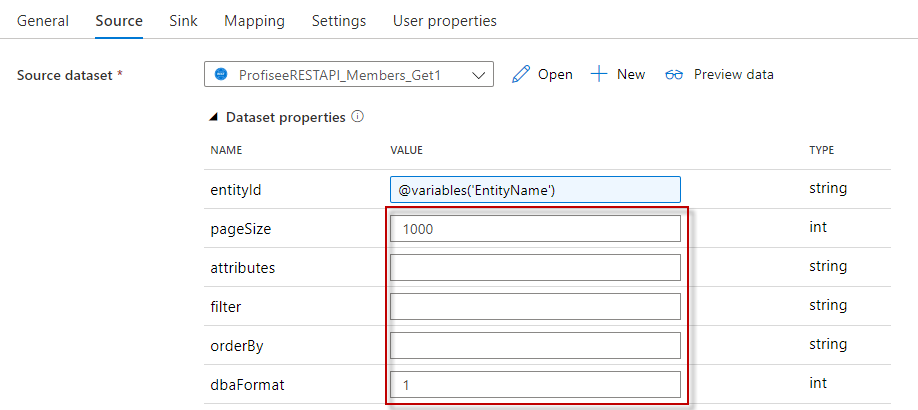

Sink parameters
---------------

> You can customize the directory and file name by changing the template
> values for the following parameters.
>
> 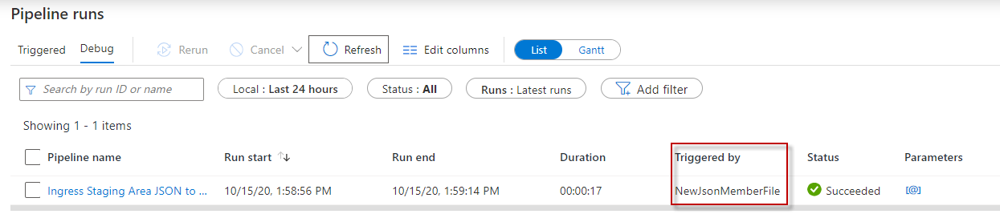

Next steps
----------

-   [Introduction to Azure Data
    Factory](https://github.com/MicrosoftDocs/azure-docs/blob/master/articles/data-factory/introduction.md)
